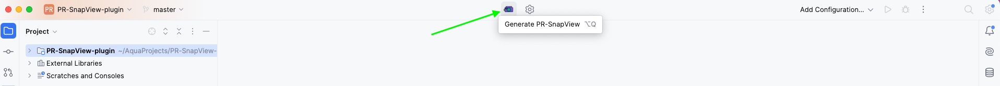
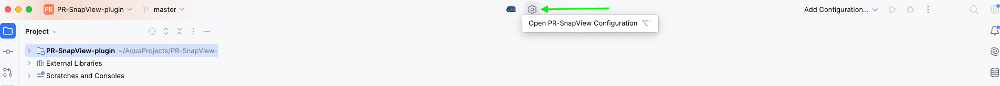
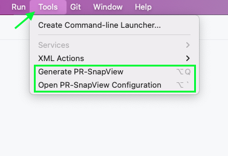
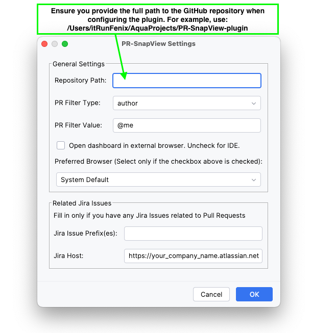
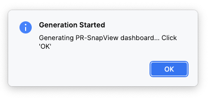
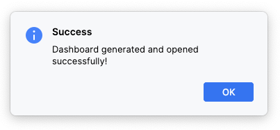
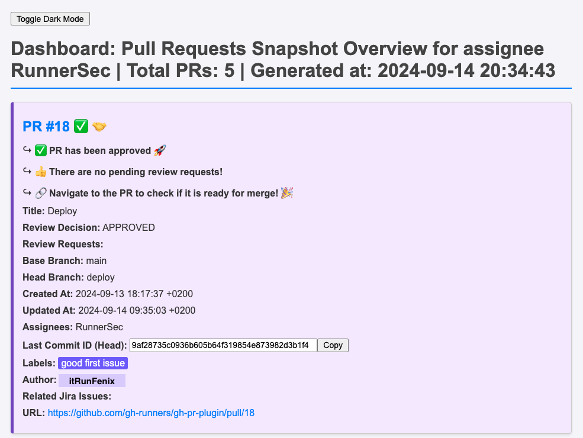

# PR-SnapView Quick Start

### PR-SnapView is a plugin that generates an HTML dashboard with information about **open** Pull Requests for a given author or assignee.

> **_Please note that any actions or decisions related to pull requests should be taken after reviewing the pull requests directly on GitHub._**
> **_PR-SnapView is intended for informational purposes only and provides an overview of pull requests._**

## Before We Start

Before using PR-SnapView, ensure that you have checked the [Prerequisites.md](/Users/piotr.zadora/AquaProjects/PR-SnapView-plugin/Prerequisites.md) file and prepared your environment.

## Quick Start Guide

  **Install the Plugin**

   To get started with PR-SnapView, you first need to install the plugin. If you haven't already, navigate to your IDE to install the plugin from the JetBrains Marketplace.

### 1.  **Plugin Location and Features**

After installing the **PR-SnapView** plugin, the user will find it in both the **Main Toolbar Center** and the **Tools Toolbar**. 

- **Main Toolbar Center**

- **Tools Toolbar**

If you do not want the plugin in the Main Toolbar Center, you can simply customize the toolbar and remove the plugin from the center location.
After that, you will still be able to use the plugin through the Tools tab.
It is recommended to set some keyboard shortcuts for the plugin, specifically for the actions: `Generate PR-SnapView` and `Open PR-SnapView Configuration`

**The plugin consists of two main features:**

- 1. **Generate PR-SnapView Button** – Allows you to quickly generate an HTML overview of the Pull Requests from the selected GitHub repository.

- 2. **Open PR-SnapView Configuration Button** – A separate settings panel where you can configure parameters such as the repository, pull request author, and other filters.

### 2. **Configure the Plugin**

### Configuration Context

The configuration settings are saved and operate within the context of each project. This means that the user can have different configurations for various projects.

- The **Repository Path** does not have to be tied to the specific project currently open in the IDE. For example, you can be working in a project in DataGrip where no repository is linked, and still set the path to a different repository to generate Pull Request reports.

- Each project can maintain its own configuration, allowing you to seamlessly switch between projects and repositories without reconfiguring the plugin.

This flexibility ensures that you can generate reports from any GitHub repository, regardless of the project currently open in the IDE.

**Configure the plugin by setting the GitHub repository URL and other relevant options.**

**PR-SnapView Settings** contains two main sections:  
**General Settings** and **Related Jira Issues**

#### General Settings:
- **Repository Path:** Provide the full local path to your repository.
- **PR Filter Type:** Choose between `author` or `assignee`.
- **PR Filter Value:** Default is `@me`, meaning the PR-SnapView will generate for your account. You can also specify any other GitHub user.
- **Open dashboard in external browser:** Uncheck this to open the dashboard directly within the IDE. If this option is checked, you can specify an external browser to open the dashboard outside the IDE.

#### Related Jira Issues:
This works if you have any Jira issues referenced in the PR title.
- **Jira Issue Prefix(es):** e.g. `PR`, `BUM` — if you have any Jira projects with keys like `PR-1`, `BUM-3098`, etc.
- **Jira Host:** The URL of your company’s Jira instance on the atlassian.net domain.

### 3. **Generate the Dashboard**

Once configured, you can generate the Pull Request dashboard by following these steps:

- Click the `Generate PR-SnapView` button.
- A message will appear, confirming that the dashboard generation has started. Click **OK** (or Enter on the keyboard) to continue working as normal. 
- **The operation runs in the background and does not block your IDE.**

  

- Once the dashboard is generated, a notification will appear confirming the completion.

  

### 4. **View the Dashboard**

- The plugin generates an HTML file named `dashboard.html` in your working directory and **automatically opens** it in the browser specified in the plugin configuration.

- The dashboard presents a dynamic, user-friendly **card view format for each Pull Request**, offering a quick overview of essential information such as PR titles, review decisions, and requested reviews. 

- Each card **highlights important details** like commit IDs, assignees, and any related Jira issues.

- Additionally, the dashboard provides **direct links to each PR** and associated Jira issues, enabling seamless navigation. You can also **easily copy the last commit ID with a single click** for efficient reference and usage.

**The dashboard features a dynamic, user-friendly card view format for each Pull Request. Each card is divided into two sections:**

1. **Custom Messages:** These are designed to quickly convey the status of the PR with clear, actionable insights. Examples include:
   - **PR #18 ✅ 🤝**  
     ↪ ✅ PR has been approved 🚀  
     ↪ 👍 There are no pending review requests!  
     ↪ 🔗 Navigate to the PR to check if it is ready for merge! 🎉

2. **GitHub-Generated Information:** Detailed data directly from GitHub, including:
   - **Title:** Deploy
   - **Review Decision:** APPROVED
   - **Review Requests:**
   - **Base Branch:** main
   - **Head Branch:** deploy
   - **Created At:** 2024-09-13 18:17:37 +0200
   - **Updated At:** 2024-09-14 09:35:03 +0200
   - **Assignees:** RunnerSec
   - **Last Commit ID (Head):** 9af28735c0936b605b64f319854e873982d3b1f4 [Copy]
   - **Labels:** good first issue
   - **Author:** itRunFenix
   - **Related Jira Issues:**
   - **URL:** [Link to PR](https://github.com/gh-runners/gh-pr-plugin/pull/18)

### 5. **Troubleshooting**

   If you encounter any issues:
   - Ensure that all required tools are installed and properly configured. [Prerequisites.md](/Users/piotr.zadora/AquaProjects/PR-SnapView-plugin/Prerequisites.md)
   - Check the plugin settings for any misconfigurations.
   - Refer to the [Troubleshooting.md](/Users/piotr.zadora/AquaProjects/PR-SnapView-plugin/Troubleshooting.md) for common issues and solutions.

## Additional Resources

- [JetBrains Marketplace](https://plugins.jetbrains.com/)
- [GitHub CLI Documentation](https://cli.github.com/)
- [jq Documentation](https://stedolan.github.io/jq/)
- [sed Documentation](https://www.gnu.org/software/sed/manual/sed.html)

Feel free to explore more features and options available in PR-SnapView to customize your dashboard according to your needs.
